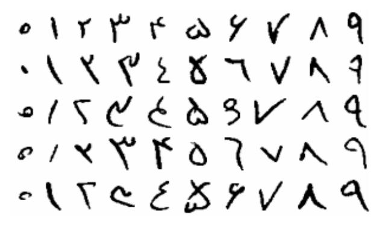

# MLP-FarsiDigits

In this project I have classified Farsi digits by using the <a href="https://github.com/amir-saniyan/HodaDatasetReader">Hoda Farsi Digit Dataset</a>.

I have calculated the Precision, Recall, and F1-Score for the whole dataset and each class
individually and Plotted the error for both train and test dataset during the learning.
